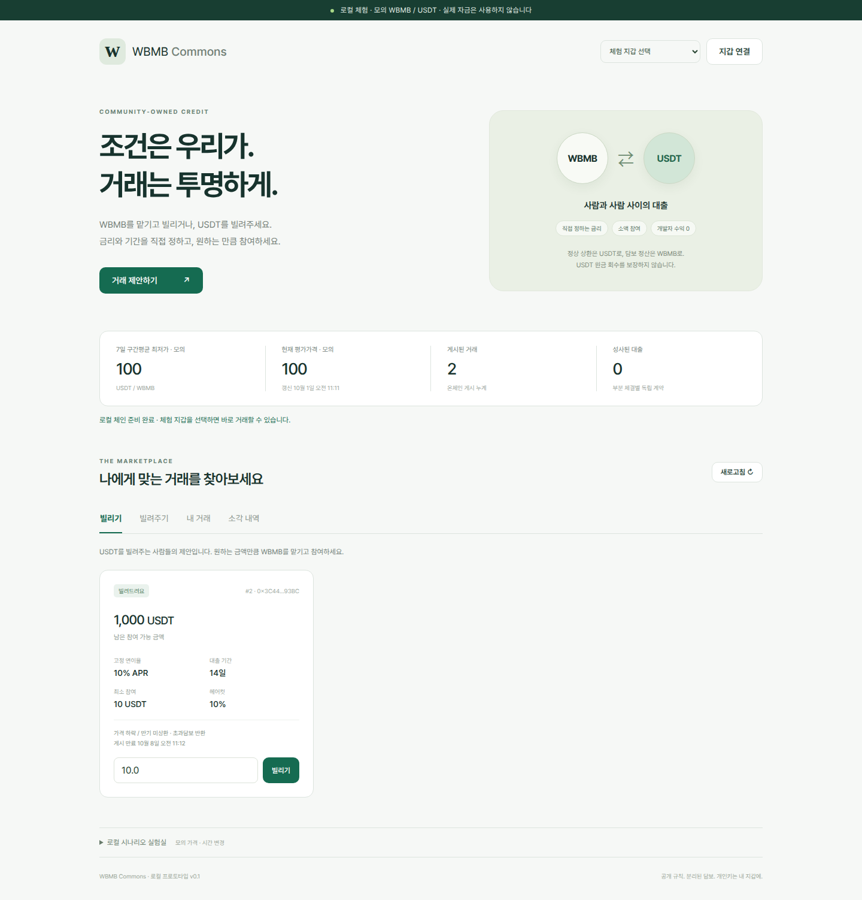

# WBMB ⇄ MOVN P2P 직거래 — 아이디어 브랜치

> 이 브랜치(`feature/wbmb-movn-swap`)는 **아이디어와 설계를 공유하는 곳**입니다. 직거래 컨트랙트와 화면은 로컬 체험용으로 구현되어 있고, 실제 체인에 배포된 것은 없습니다. 외부 감사는 받지 않았습니다.

사람끼리 WBMB와 MOVN을 직접 사고파는 게시판을 만들려는 구상입니다. 대출 시장과는 별개의 기능입니다.

**어떻게 거래하나**

- 누구나 "WBMB N개를 개당 P MOVN에 팝니다 / 삽니다" 글을 올립니다. 올릴 때 팔 물건(WBMB 또는 MOVN)을 컨트랙트에 맡깁니다.
- 다른 사람이 원하는 만큼만 나눠서 체결할 수 있습니다. 체결하는 거래 한 번에 양쪽 토큰이 바로 상대에게 갑니다.
- 가격과 수량은 올린 뒤 바꿀 수 없습니다. 바꾸려면 취소하고 다시 올립니다. 남은 물건은 언제든 되찾습니다.
- 게시 기간은 기본 30일(1~90일)입니다.

**수수료**

- WBMB를 **파는 쪽**이 받는 MOVN 대금의 **0.5%**. 예: 10 WBMB × 112 MOVN = 1,120 MOVN → 판매자 1,114.4 MOVN, 수수료 5.6 MOVN.
- 다음 단계 구상: 모인 수수료 MOVN으로 시장에서 WBMB를 되사서 소각 주소로 보냅니다(바이백 소각). 대출 이자 수수료도 같은 길로 보냅니다.

**운영자가 할 수 없는 것**

- 컨트랙트에 관리자, 업그레이드, 임의 인출, 수수료율 변경 기능을 넣지 않습니다. 수수료율과 수수료 받는 주소는 배포 때 고정됩니다.

**알고 시작해야 하는 위험**

- 외부 감사를 받지 않았습니다. 컨트랙트는 고칠 수 없으므로 버그가 있으면 새로 배포해야 합니다.
- 가격 실수는 컨트랙트가 막지 않습니다. 화면이 카운슬 가격과 20% 이상 불리할 때 경고할 뿐입니다.
- MOVN·WBMB 발행자의 권한(정지, 주소 차단, 추가 발행)은 그대로입니다.
- 유니스왑 MOVN/WBMB 풀의 유동성이 얕아 바이백은 가격 조작에 약합니다. 보호선과 회당 한도는 아직 정하지 않았습니다.

**진행 순서**

| 단계 | 내용 | 상태 |
|---|---|---|
| ① 직거래 | `P2PSwap` 컨트랙트 + "WBMB 사고팔기" 화면 | 컨트랙트와 로컬 화면 구현, 실제 배포 전 |
| ② 바이백 소각 | 수수료 MOVN으로 WBMB를 사서 소각, 봇 가스비 BNB 확보 | 초안, 미정 항목 있음 |
| ③ 대출 연결 | 대출 수수료도 바이백으로 보내는 새 대출 시장 | 구상 |

**직접 해 보기 (모의 토큰, 내 컴퓨터 안에서만)**

```bash
npm ci
MARKET=council npm run dev    # http://127.0.0.1:5180 → 체험 지갑 선택 → "WBMB 사고팔기" 탭
npm test                      # 컨트랙트 시험 (직거래는 tests/swap.test.mjs)
npm run deploy:bsc:swap       # BSC 배포 예상 비용만 계산 (FEE_WALLET 필요, 전송 없음)
```

컨트랙트는 [contracts/P2PSwap.sol](contracts/P2PSwap.sol) 한 파일입니다. 배포 방법과 검증 범위는 [docs/MAINNET.md 9절](docs/MAINNET.md)에 있습니다.

**자세한 문서**

- [직거래 설계 (①)](docs/superpowers/specs/2026-10-06-p2p-swap-design.md)
- [직거래 + 바이백 소각 초안 (①~③ 전체 구상, 남은 질문)](docs/superpowers/specs/2026-10-05-wbmb-movn-swap-buyback-design.md)

아래는 이 브랜치가 갈라져 나온 대출 프로젝트의 원래 README입니다.

---

# WBMB Commons — P2P 대출 프로젝트

WBMB 보유자와 MOVN 보유자가 직접 금리·기간을 제안하고, 원하는 금액만큼 나누어 체결하는 대출 프로토타입입니다. 정상 상환은 MOVN, 담보 정산은 WBMB로 처리합니다.

**현재 버전은 로컬에서 실행하는 완결된 체험 환경입니다.** 실제 WBMB/MOVN·BSC 메인넷·실제 거래소 가격을 사용하지 않습니다. 계약은 외부 감사를 받지 않았으며 실자금 서비스가 아닙니다.



## 실전(BSC 메인넷) 버전

`feature/mainnet-v1`부터 실제 BSC의 MOVN·WBMB로 동작하는 **오라클 없는 만기형 시장**을 배포할 수 있습니다. 게시자가 담보 수량을 직접 정하고, 가격 청산 없이 만기 + 유예 1일 뒤 미상환이면 담보가 대출자에게 넘어갑니다. 수수료(이자의 5%)는 소각하지 않고 배포 시 고정한 수수료 지갑에 보관합니다. 외부 감사는 받지 않았습니다. 배포 순서·검증 범위·남은 위험은 [docs/MAINNET.md](docs/MAINNET.md)를 따르세요.

카운슬 가격으로 청산하는 시장(부채에 보너스 10%를 더한 만큼의 WBMB만 대출자에게, 나머지는 차입자에게)도 코드와 테스트까지 끝났지만 **아직 배포하지 않았습니다.** 운영 방법은 [docs/MAINNET.md 8절](docs/MAINNET.md)을 따르세요.

```bash
npm run rehearse                 # 실제 토큰 코드 복제 + 배포 리허설 + 실전 화면 리허설 (전송 없음)
npm run deploy:bsc               # 예상 비용만 계산 (전송 없음)
MARKET=fixed npm run dev         # 같은 시장을 모의 토큰으로 로컬 체험
MARKET=council npm run dev       # 카운슬 가격으로 청산하는 시장을 모의 토큰으로 로컬 체험
npm run relay:council            # 카운슬 가격 중계 봇: 플래그 없이는 출력만, --broadcast 일 때만 BNB를 쓰고 전송
                                 # (한도를 넘는 변동은 하루 30%씩 자동으로 따라감: docs/MAINNET.md 8.3)
npm run build:live:council       # deployments/bsc-council-movn.json 으로 실전 웹 파일 생성 (전송 없음)
```

아래 내용은 로컬 체험 환경(가격형 시장 포함)에 대한 설명입니다.

## 실행

Node.js 22.12 이상(검증 환경 26.8.1), npm이 필요합니다.

```bash
npm ci
npm run dev
```

브라우저에서 **http://127.0.0.1:5180**을 엽니다. 한 명령이 Solidity 컴파일, 로컬 EVM, 모의 자산/가격 배포, 예시 게시글 생성, 웹 서버를 실행합니다. 서버는 loopback에만 바인딩합니다.

- 로컬 체인: `31337`, RPC `http://127.0.0.1:18545`
- 기본 웹 포트: `5180`
- 변경 예: `RPC_PORT=18547 APP_PORT=5182 npm run dev`
- 종료: 실행 터미널에서 `Ctrl+C`. 로컬 체인 상태는 메모리에만 있으며 다음 실행 시 새로 시작합니다.
- 외부 비밀키·기존 거래 시스템의 `.env`·기존 지갑을 불러오지 않습니다.
- 최신 기본 배포 주소는 생성된 `public/deployment.json`에 있습니다. 실행별 설정은 `.local/web-포트번호/deployment.json`으로 분리하며 모두 Git에서 제외합니다.

## 5분 체험

1. 상단 **체험 지갑 선택 → 체험 1**을 선택합니다. 100 WBMB/10,000 MOVN으로 시작하며, 예시 차입 요청에 10 WBMB가 이미 잠겨 있습니다.
2. **빌리기**에서 체험 2가 게시한 MOVN 대출 제안을 찾고 `90`을 입력해 **빌리기**를 누릅니다. 조건 확인 → 토큰 승인 → 실제 로컬 체결이 진행됩니다.
3. **내 거래**에서 담보를 `0.2 WBMB` 추가합니다. 다른 대출의 담보에는 영향을 주지 않습니다.
4. 하단 **로컬 시나리오 실험실 → 1일 경과**를 누르면 발생 이자를 확인할 수 있습니다.
5. **이자만 납부** 또는 **상환**을 실행합니다. 원금을 전액 갚으면 **WBMB 수령**으로 담보를 받습니다.
6. **체험 2**로 바꾸고 **내 거래 → MOVN 수령**을 누르면 대출 원금과 지급된 이자를 받습니다.
7. **소각 내역**에서 수수료 이동과 모의 매입·소각을 실행합니다. 소각 실패는 상환을 막지 않습니다.

반대 방향: 체험 2나 3으로 **빌려주기**에 들어가 체험 1의 차입 요청을 일부 체결할 수 있습니다. **거래 제안하기**로 양쪽 방향의 새 게시글을 만들고 최소 참여액·APR·기간을 정할 수 있습니다.

가격 정산 체험은 새 대출을 체결한 뒤 실험실 가격을 `94` 등으로 낮추고 **WBMB 정산 조건 확인**을 누릅니다. 담보를 추가했거나 낮은 금액만 빌렸다면 건강한 상태일 수 있습니다. **WBMB 정산은 MOVN 원금 회수와 다릅니다.**

## 지갑 연결

브라우저 지갑은 EIP-6963 탐색과 EIP-1193 요청을 사용합니다. 개인키·시드 입력란이 없고, 웹 서버가 사용자의 개인키를 보관하지 않습니다. 지갑이 없는 경우 체험 지갑이 로컬 노드의 공개 테스트 계정을 사용합니다.

브라우저 지갑으로 실제 로컬 서명 흐름을 확인하려면:

1. **지갑 연결**을 누르고 로컬 네트워크 31337로 전환합니다.
2. 해당 주소에는 모의 토큰과 로컬 가스가 있어야 합니다. 체험 지갑은 이미 충전되어 있지만, 임의의 브라우저 지갑 주소에는 자동 지급하지 않습니다.
3. 필요하면 아래 개발자용 faucet 명령으로 **로컬 모의 자산만** 지급합니다.

```bash
node scripts/faucet.mjs 0xYOUR_PUBLIC_ADDRESS
```

계정/체인이 바뀌면 연결을 무효화합니다. 승인과 체결 사이에도 체인·세션을 다시 검사합니다. 거래 게시·체결은 온체인이므로 별도 서버 로그인/SIWE 세션은 이번 버전에 필요하지 않습니다.

## 구현 범위

| 기능                                                                                         | 상태                                    |
| -------------------------------------------------------------------------------------------- | --------------------------------------- |
| 양방향 게시 / 자금 에스크로 / 미체결 취소·회수                                               | 구현                                    |
| 최소 참여액 / 부분 체결 / 마지막 잔여분 / loan별 담보 분리                                   | 구현                                    |
| 고정 단리 APR / 초 단위 발생 이자 / 부분 원금·이자만·전액 상환                               | 구현                                    |
| 추가 담보 / 전액 상환 후 반환 / 각자 수령                                                    | 구현                                    |
| 가격+만기 WBMB 정산 / 초과담보 반환 / 담보 부족분 대출자 부담                                | 구현, 모의 가격                         |
| 만기만 정산 / 남은 담보 전부 귀속                                                            | 별도 명시적 모드로 구현                 |
| 공급자 이자와 수수료 분리 / 개발자 배분 없음                                                 | 구현                                    |
| 7일 30분 구간 336개 검증·최저값 계산                                                         | 순수 계산 모듈·테스트 구현, 합성 데이터 |
| 가격 관측 지연 / 누락·괴리 거부                                                              | 계산 모듈 및 로컬 가격 만료 처리        |
| 서명 가격 보고서 오라클 (EIP-712, 2-of-3 서명, round·유효기한·336구간·소스 괴리 온체인 검사) | 구현, 합성 데이터·로컬 보고자           |
| 실제 LBank/Uniswap v4 가격 수집·온체인 증명                                                  | 미구현                                  |
| 실제 WBMB 매입·소각                                                                          | 미구현. 로컬 모의 토큰의 burn만 구현    |
| 메인넷/공개 테스트넷 배포, 외부 감사, 실제 지갑 실사용 검증                                  | 미수행                                  |

## 이번 구현에서 정한 체험 기본값

이 값은 검증된 운영 추천값이나 사용자의 최종 승인이 아닙니다.

- 담보: WBMB 8 decimals, 대출: MOVN 18 decimals.
- 헤어컷 10%, 가격 청산 경계 95%, 만기 유예 1일.
- 고정 **APR**, 복리 APY 아님. 조기 상환은 실제 경과기간의 이자만 부담합니다.
- 이자는 만기에서 멈추며 유예 중 연체 이자·벌금은 없습니다.
- 수수료는 **지급 이자의 5%를 차입자가 추가 부담**합니다. 원금의 5%가 아닙니다.
- 각 게시글은 체결 후 바꿀 수 없고, 각 부분 체결의 시점부터 만기가 시작됩니다.
- 초기 버전은 중도 담보 인출·대출채권 양도·자동 재대출을 지원하지 않습니다.
- 미체결 주문을 닫으면 자산은 maker의 수령 잔액에 기록되며, 별도 수령 거래가 필요합니다.
- 만료 주문은 누구나 닫을 수 있지만 자산은 항상 원래 maker에게 귀속됩니다.

### 두 정산 모드는 서로 다른 계약입니다

**가격+만기:** 현재 검증가격으로 대출자에게 `min(담보, 올림(부채/가격))` WBMB를 배정하고 초과분은 차입자에게 반환합니다. 가격이 오래되면 신규 체결과 정산이 멈춥니다. 상환·담보 추가·취소·수령은 계속됩니다. 오라클 영구 장애 시 만기 정산도 지연될 수 있습니다.

**만기만·전체 귀속:** 가격 하락으로는 정산하지 않고 만기+유예가 지난 후 **추가 담보를 포함한 남은 담보 전부**를 대출자에게 넘깁니다. 부분 원금 상환 후 작은 부채만 남아도 이 규칙은 같습니다. 가격 오라클 없이 정산할 수 있는 대신 경제적 조건이 다릅니다. 생성 화면과 확인창에서 이를 명시합니다. 기본 선택은 가격+만기입니다.

어느 모드든 누구나 정산을 호출할 수 있지만 호출자에게 자산을 지급하지 않습니다. 대출자와 차입자의 수령 잔액으로만 배정합니다. 정산 후 원금·이자 채권은 컨트랙트에서 종료되며 다른 대출 자산으로 손실을 메우지 않습니다.

## 프로젝트 구조

```text
contracts/
  P2PLending.sol           주문·대출·이자·담보·정산·수령
  IPricePolicy.sol         가격 인터페이스
  SignedPricePolicy.sol    서명 가격 보고서 검증 (보고자·임계값 고정)
  mocks/
    MockToken.sol         로컬 전용 8/18자리 자산
    MockFeeBurner.sol     로컬 모의 교환·공급량 소각
    FaultyToken.sol       전송 실패·세금·재진입 테스트 토큰
src/
  app.js                  실제 로컬 컨트랙트와 연결된 웹 화면
  prices.mjs              7일 가격 보고서 계산·검증
  report-signing.mjs      보고서 EIP-712 서명·제출
scripts/
  compile.mjs             고정된 solc로 빌드·ABI 생성
  deploy.mjs              로컬 배포·모의 자금·예시 주문
  dev.mjs                 로컬 EVM+웹 통합 실행
  faucet.mjs              로컬 공개 주소에 모의 자산 지급
tests/                    EVM·가격 계산·브라우저 테스트
docs/DESIGN.md             원본 설계 문서 스냅샷
docs/IMPLEMENTATION.md     구현 선택·회계·남은 작업
```

## 검증

```bash
npm test                   # Solidity 컴파일 + 독립 로컬 EVM + 가격 계산 테스트
npm run build              # 웹 배포용 정적 파일 생성 (실자금 배포 아님)
npx playwright install chromium
npm run test:browser        # 별도 체인 18546 / 화면 5181에서 E2E
npm run check               # 위 검증을 순서대로 실행
npm audit
```

브라우저 테스트도 실제 로컬 컨트랙트를 호출합니다. 지갑 연결 테스트의 EIP-1193 provider는 모의 공급자이며 실제 MetaMask/Rabby 확장 검증은 아닙니다. 테스트넷·메인넷·실제 WBMB 유동성에 대한 증거로 해석하지 않습니다.

작성 시점 검증: EVM·오라클·가격 테스트 39개 + 브라우저 테스트 6개 통과, 웹 빌드 성공, npm audit 0건. [검증 기록](docs/VALIDATION.md) 참조. GitHub Actions 실행 설정도 포함합니다.

브라우저 테스트는 별도 체인·웹 포트와 `.local/web-5181` 설정을 사용하므로 기본 체험 화면과 자금 상태를 공유하지 않습니다. `npm run build` 산출물은 기본 로컬 체인을 한 번 배포한 뒤 생성해야 하며, 사용할 때도 해당 로컬 RPC가 실행 중이어야 거래할 수 있습니다. 사용자 지정 포트의 faucet은 `DEPLOYMENT_FILE=.local/web-5182/deployment.json node scripts/faucet.mjs 0xPUBLIC_ADDRESS`처럼 설정을 지정합니다.

## 자금 권한과 다음 단계

`P2PLending`에는 owner·업그레이드·임의 인출·수수료 변경 함수가 없습니다. 토큰·가격 정책·수수료 수취 컨트랙트는 생성 시 고정됩니다. 가격 정책 `SignedPricePolicy`도 owner가 없으며 보고자 집합·서명 임계값·정책 ID·괴리 한도가 생성 시 고정됩니다. 보고서는 보고자 3명 중 2명의 EIP-712 서명이 있어야 반영되고, 제출은 누구나 할 수 있습니다. 다만 현재 보고자는 **로컬 노드의 테스트 계정**이고 보고서 내용은 합성 데이터입니다. 서명 검증은 데이터가 실제 거래소에서 왔다는 증명이 아닙니다. 모의 토큰·소각기는 생성자에서 chain 31337을 강제합니다. 실제 BSC 주소는 배포 설정에 사용하지 않습니다.

실제 운영으로 가려면 청산 모드·가격 정책을 확정하고, 검증 가능한 가격 수집/보고·WBMB와 BMB 전환 위험·실제 토큰 전송/관리권·매입/소각 경로·오라클 장애 복구·독립 보안 검토를 완료해야 합니다. 자세한 내용은 [구현 기록](docs/IMPLEMENTATION.md), 제품 기준은 [원본 설계](docs/DESIGN.md)를 확인하세요.

GitHub에 올릴 수 있는 독립 로컬 Git 저장소로 구성합니다. 원격 저장소 생성·공개 게시·실자금 배포는 이번 작업에 포함하지 않습니다.
